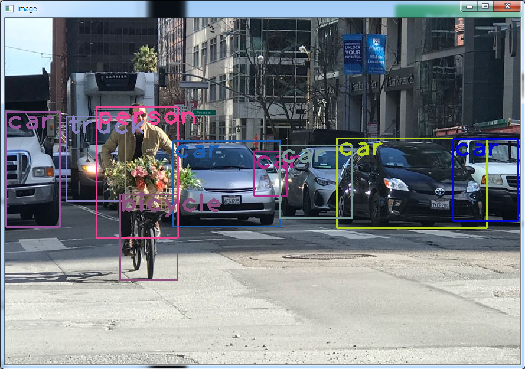
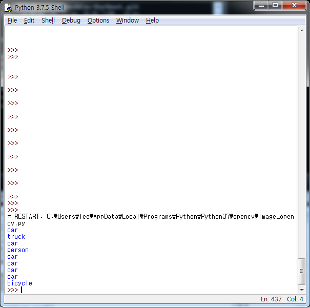

# OpenCV_Recognition / 사물인식
Image reading using opencv and yolo pre-trained model
OpenCV와 YOLO 교육 모델을 이용한 사물인식

Download [yolov3.weights](https://pjreddie.com/media/files/yolov3.weights) and [yolov3.cfg](https://github.com/pjreddie/darknet/blob/master/cfg/yolov3.cfg)
put them in your project folder along with coco.names

replace 
img = cv2.imread('Image/test1.jpeg')
with
img = cv2.imread(' --- your image path --- ')

